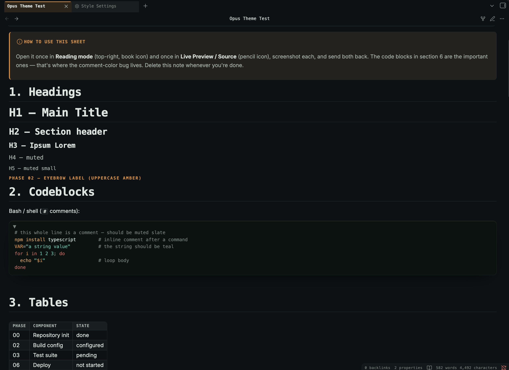
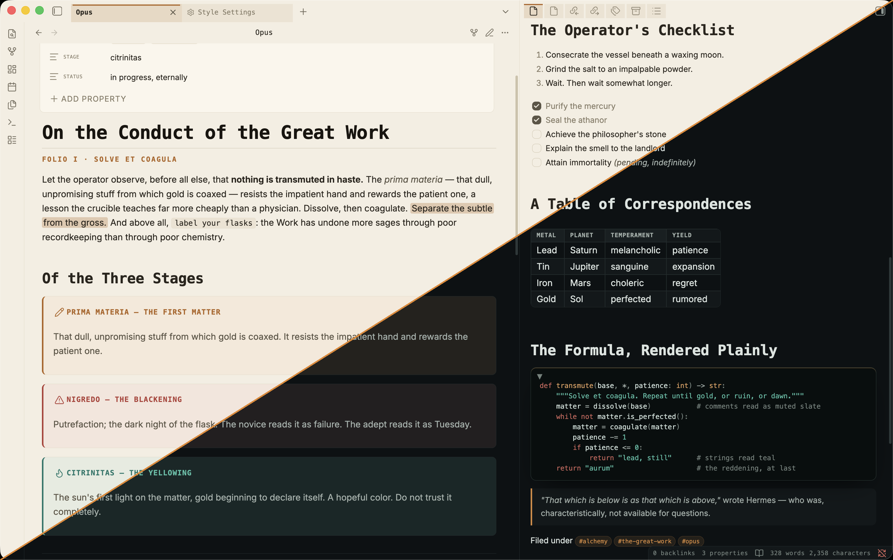
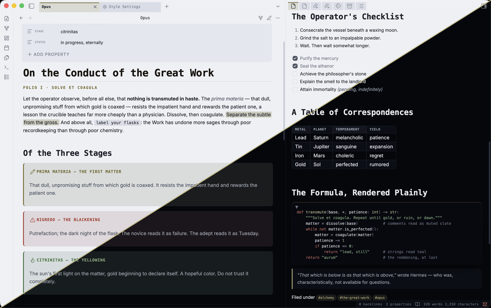
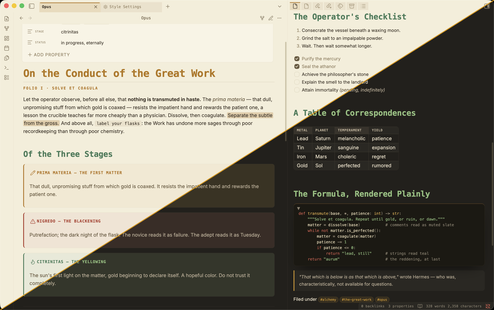

# Opus

A cold, monospace-forward Obsidian theme with a small, consistent color system. Three palettes drawn from the alchemical *Magnum Opus*, each tuned for light and dark. At home on desktop and mobile.

## The idea

Color is used sparingly and always means something: one accent for structure and the active item, teal for good, clay for warning, and not much else. Headings are monospace and separate by size and weight rather than color, so long notes stay calm. The same accent marks the active file, the active tab, and the active table row, so the whole app reads the same way.

- **Monospace headings** on a fixed type scale — hierarchy by size and weight, not per-level color.
- **Consistent semantics** — accent, teal (good), clay (warning), used the same way across callouts, tasks, syntax, and canvas.
- **Readable code in both views** — comments in muted slate, matched between Reading and Live Preview, tuned for light and dark.
- **Canvas** — Obsidian's six preset colors remapped to a quieter set; nodes as clean cards, groups as small mono labels, thin edges.
- **Mobile** — bigger touch targets, elevated nav drawers, and reading width and type tuned for a phone.
- **Plugins** — Dataview, Kanban, Canvas, Graph, Properties, tables, embeds, and print are all styled to match.

## Flavors

Switch them in Style Settings. Each is a full palette in light and dark, contrast-checked.

| Flavor | Stage | Palette |
| --- | --- | --- |
| **Prima Materia** | the first matter *(default)* | cool slate (dark) / warm latte (light), amber accent |
| **Nigredo** | the blackening | stark true-black, high contrast |
| **Citrinitas** | the yellowing | warm & cozy, Gruvbox-spirited (one accent) |

Each shot below is split diagonally — **light** above, **dark** below.

**Prima Materia** — the default. Cool slate in dark, warm latte in light.

**Nigredo** — stark true-black, high contrast.

**Citrinitas** — warm and cozy, Gruvbox-spirited. The only flavor that colors its headings, tonally leveled so the hues read as one family.

## Install

**Community store:** Settings → Appearance → Manage themes → search **Opus**.

**Manual:** put `manifest.json` and `theme.css` in `YourVault/.obsidian/themes/Opus/`, then Settings → Appearance → Themes → **Opus**.

## Style Settings

Opus works on its own; the [Style Settings](https://github.com/mgmeyers/obsidian-style-settings) plugin adds a settings panel (Settings → Style Settings → Opus):

- **Flavor** — the three palettes above.
- **Accent color** — one picker for the accent; teal and clay stay fixed. Overrides the current flavor.
- **Layout & motion** — heading spacing, a compact mode, and a motion toggle.
- **Measure** — line width, font size, and line height.
- **Typography** — sans-serif headings; body and monospace font overrides.
- **Features** — hide the active-file/tab rails, flat code blocks, dark code in light mode, vivid canvas colors.
- **OLED & contrast** — true black and higher contrast (dark mode).
- **Mobile** — text scale and a leaner note header.

## Compatibility

Obsidian 1.4.0+. Light and dark, Reading and Live Preview, desktop and mobile, all three flavors.

## License

MIT.
